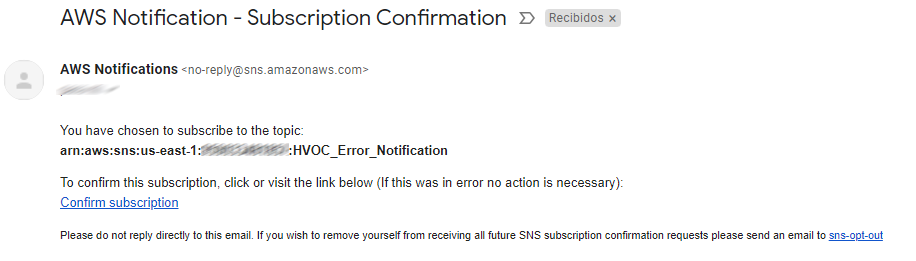

# Lambda Function with SNS Notification

This terraform manifest is intended to be used as a canvas to implement  lambda functions with error handling and email notifications.

> 👉🏼 This is just a blank canvas; the lambda does not execute any real tasks.

## Resources deployed by this manifest:

- Python Lambda Function
- IAM Role
- SNS Topic
- SNS Suscriptions

## Tested with: 

| Environment | Application | Version  |
| ----------------- |-----------|---------|
| WSL2 Ubuntu 20.04 | Terraform | v1.1.7  |

## Initialization How-To:

Located in the root directory, make an "aws configure" to log into the aws account, and a "terraform init" to download the necessary modules and start the backend.

```bash
aws configure
terraform init
```

## Deployment How-To:

Located in the root directory, make the necessary changes in the variables.tf file and run the manifests:

```bash
terraform apply
```

---- 

Each email subscriber will receive a subscription confirmation link via email. 



>💡 In order to receive emails from the lambda function, they must click on that confirmation link.
## Author:

- [@JManzur](https://jmanzur.com)

## Documentation:

- [Python boto3 documentation for SNS](https://boto3.amazonaws.com/v1/documentation/api/latest/reference/services/sns.html)